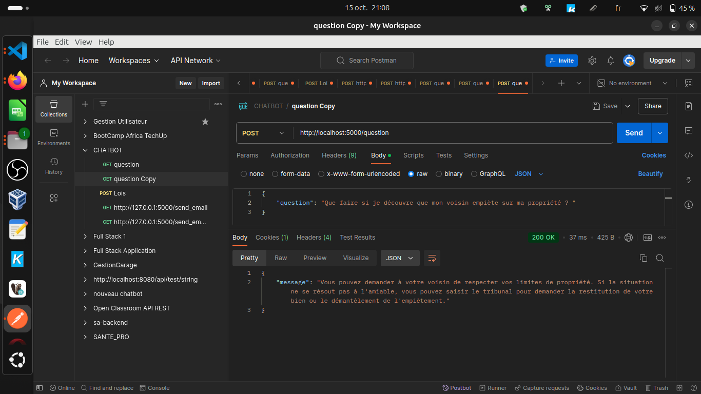
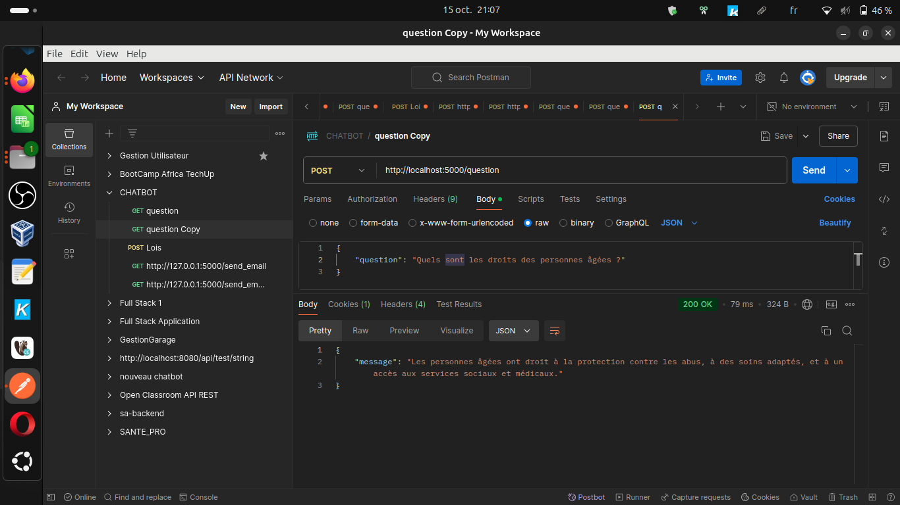
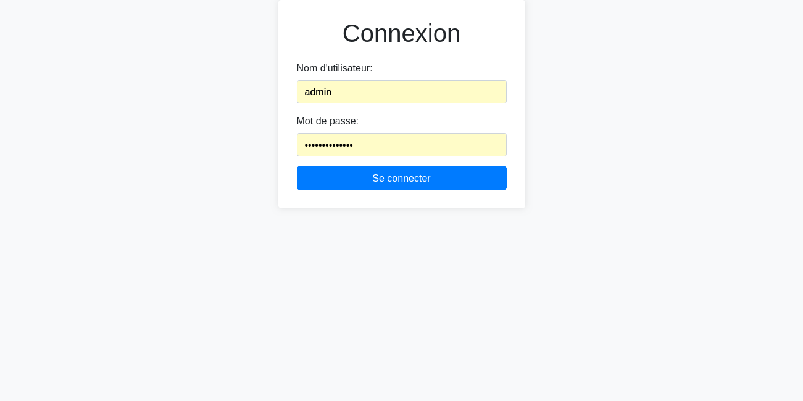
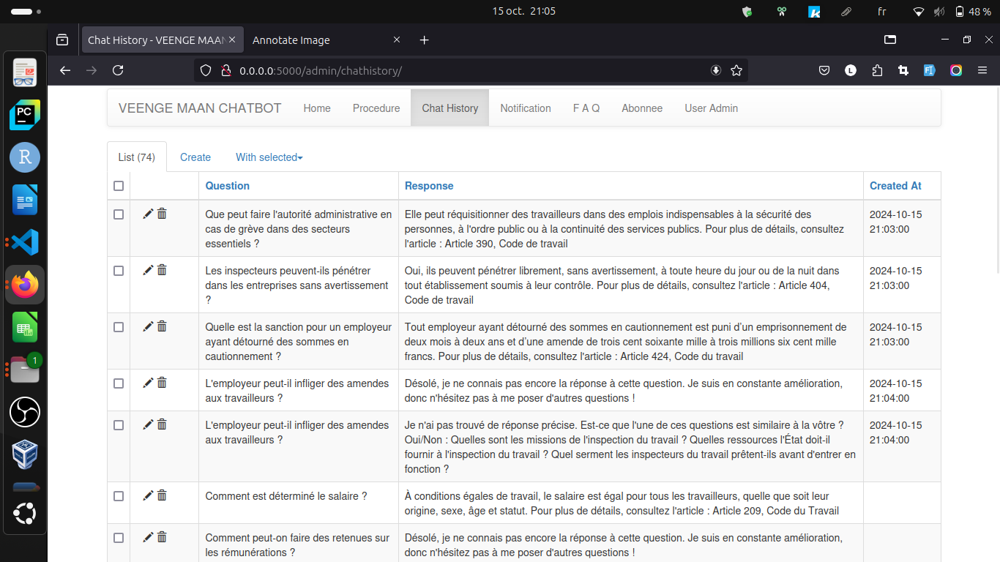

# Veenge Maan - Chatbot Juridique


**Veenge Maan** est un chatbot juridique développé dans le cadre de mon projet individuel de licence en génie logiciel, option analyse de données. Ce projet a été réalisé pour les citoyens burkinabè afin de leur fournir un accès facile aux informations juridiques et aux ressources pertinentes.

## Table des matières

1. [Prérequis](#prérequis)
2. [Installation](#installation)
3. [Lancer l'application](#lancer-lapplication)
4. [Tester les API](#tester-les-api)
5. [Fonctionnalités](#fonctionnalités)
6. [Contributions](#contributions)
7. [Captures d'écran](#captures-décran)
8. [Licence](#licence)

## Prérequis

- Python 3.x
<!-- - [Bibliothèque nécessaire 1](lien_vers_bibliothèque_1) -->
<!-- - [Bibliothèque nécessaire 2](lien_vers_bibliothèque_2) -->

## Installation

Pour installer ce projet, assurez-vous d'avoir **Python** et **pip** installés sur votre machine. Toutes les dépendances nécessaires sont listées dans le fichier `requirements.txt`.

### Étapes d'installation :

1. Clonez le dépôt :
   ```bash
   git clone https://github.com/wendtoinissaka/chatbot_juridique_front_end.git
   cd chatbot_juridique_front_end
   ```

2. Créez un fichier `.env` basé sur le modèle `.env_copy` et ajoutez vos informations :
   ```bash
   cp .env_copy .env
   ```

3. Installez les dépendances :
   ```bash
   pip install -r requirements.txt
   ```

## Lancer l'application

Pour démarrer l'application, utilisez la commande suivante :
```bash
python app.py
```
L'application sera accessible à l'adresse suivante : [http://localhost:5000](http://localhost:5000).

## Tester les API

Voici comment tester les différentes API :

1. **API de questions** : Envoyez une requête POST avec le champ `question` pour poser une question au chatbot et obtenir une réponse.
   - **Endpoint** : `/question`
   - **Méthode** : POST
   - **Exemple de requête** :
     ```bash
     curl -X POST http://localhost:5000/question -H "Content-Type: application/json" -d '{"question":"Comment demander la succession par testament ?", "user_id": "12345"}'
     ```
   - **Réponse** :
     ```json
     {
       "message": "Le testament est un acte personnel par lequel le testateur transfère...."
     }
     ```

2. **API pour obtenir une loi** : Envoyez une requête GET avec les paramètres `code` et `number` pour récupérer les informations sur une loi.
   - **Endpoint** : `/laws`
   - **Méthode** : GET
   - **Exemple de requête** :
     ```bash
     curl -X GET "http://localhost:5000/laws?code=civil&number=123"
     ```
   - **Réponse** :
     ```json
     {
       "law_detail": "Détails de la loi ici."
     }
     ```

3. **API pour l'inscription aux notifications** : Envoyez une requête POST pour vous inscrire aux notifications juridiques.
   - **Endpoint** : `/notification_signup`
   - **Méthode** : POST
   - **Exemple de requête** :
     ```bash
     curl -X POST http://localhost:5000/notification_signup -H "Content-Type: application/json" -d '{"email":"email@example.com", "numero":"123456789"}'
     ```
   - **Réponse** :
     ```json
     {
       "message": "Inscription réussie."
     }
     ```

## Fonctionnalités

- **Réponses instantanées sur les lois** : Recevez des réponses rapides à vos questions juridiques.
- **Suivi des démarches juridiques** : Tenez-vous informé sur vos démarches juridiques en cours.
- **Notifications sur les nouvelles lois** : Restez à jour avec les changements législatifs.
- **Accès à des contacts juridiques** : Trouvez des avocats et des experts juridiques facilement.
- **Téléchargement des dernières versions des codes** : Accédez aux dernières versions du Code Civil, Code du Travail, Code de la Famille, et Code Pénal.

## Administration

Un utilisateur administrateur par défaut est créé lors de l'exécution de l'application pour la première fois. Voici les identifiants par défaut :

- **Nom d'utilisateur** : `admin`
- **Mot de passe** : `admin_password`

Vous pouvez modifier ces identifiants dans la fonction `create_admin_user` dans le fichier `admin.py`.


## Captures d'écran








## Licence

Ce projet est sous licence **libre**, permettant à quiconque de l'utiliser et de le modifier.
