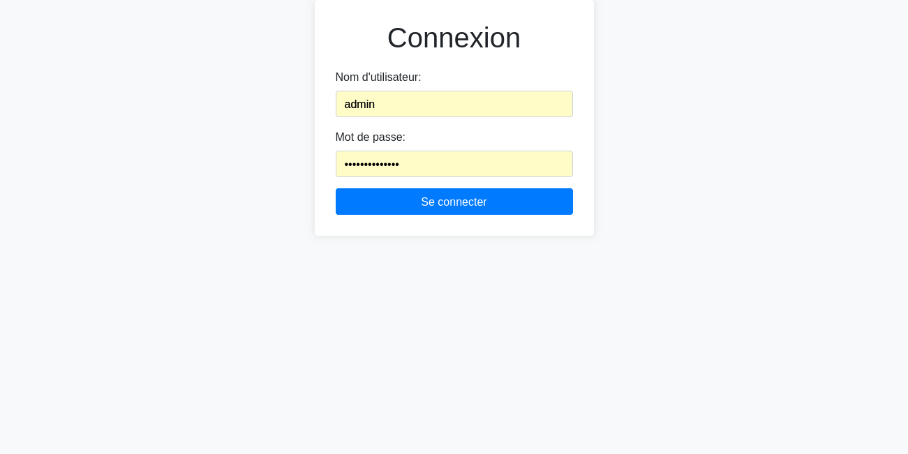

# Veenge Maan - Chatbot Juridique


**Veenge Maan** est un chatbot juridique développé dans le cadre de mon projet individuel de licence en génie logiciel, option analyse de données. Ce projet a été réalisé pour les citoyens burkinabè afin de leur fournir un accès facile aux informations juridiques et aux ressources pertinentes.

## Table des matières

1. [Prérequis](#prérequis)
2. [Installation](#installation)
3. [Lancer l'application](#lancer-lapplication)
4. [Structure du projet](#structure-du-projet)
5. [Tester les API](#tester-les-api)
6. [Fonctionnalités](#fonctionnalités)
7. [Contributions](#contributions)
8. [Captures d'écran](#captures-décran)
9. [Interaction entre le Front-end et le Back-end](#interaction-entre-le-front-end-et-le-back-end)

## Prérequis

- Python 3.x
<!-- - [Bibliothèque nécessaire 1](lien_vers_bibliothèque_1) -->
<!-- - [Bibliothèque nécessaire 2](lien_vers_bibliothèque_2) -->

## Installation

Pour installer ce projet, assurez-vous d'avoir **Python** et **pip** installés sur votre machine. Toutes les dépendances nécessaires sont listées dans le fichier `requirements.txt`.

### Étapes d'installation :

1. Clonez le dépôt :
   ```bash
   git clone https://github.com/wendtoinissaka/chatbot_juridique_front_end.git
   cd chatbot_juridique_front_end
   ```

2. Créez un fichier `.env` basé sur le modèle `.env_copy` et ajoutez vos informations :
   ```bash
   cp .env_copy .env
   ```

3. Installez les dépendances :
   ```bash
   pip install -r requirements.txt
   ```

## Structure du Projet

Voici un aperçu de la structure des dossiers et fichiers principaux de ce projet, ainsi qu'une brève explication de leur rôle.

### Dossiers

- **colab/** : Ce dossier contient les fichiers utilisés sur colab pour l'entrainement et l'évaluation du modèle Spacy.

- **flask_session/** : Ce dossier contient les fichiers de session utilisés par Flask pour gérer les utilisateurs et leurs connexions de manière temporaire.
  
- **imgs/** : Stocke les images utilisées dans la documentation ou dans l'application.

- **models/** : Contient les définitions des modèles de données (ChatHistory, Notification, Abonnee, ..., pour la base de données). Les classes ici représentent les structures utilisées pour les interactions avec la base de données.

- **routes/** : Contient toutes les routes (endpoints) de l'API Flask. Chaque fichier de ce dossier gère un groupe spécifique de routes.

- **services/** : Contient le modele NLP/Spacy que l'on a entrainé sur colab et sauvegarder.

- **stockage_nettoyage_donnees/** : Contient les scripts utilisés pour le web scraping, l'extraction des pdf,le nettoyage des données. Les données extraites sont enregistrées dans des fichiers csv et json.

- **templates/** : Ce dossier contient le fichier HTML utilisé pour générer le login de l'administrateur, et le template pour les messages  de notifications qui seront envoyés aux abonnées.

### Fichiers

- **app.py** : Le point d'entrée de l'application Flask. Ce fichier initialise l'application et configure les routes, les extensions et les services nécessaires.

- **admin.py** : Contient probablement la logique liée aux utilisateurs administrateurs (par exemple, la création, la gestion des droits d'accès, etc.).

- **chatbot_entrainement.py** : Ce fichier la version .py du notebook utilisé sur colab pour l'entrainement.

- **code_du_travail.json** : Un fichier JSON qui contient les informations juridiques sur le Code du Travail, utilisées par le chatbot pour répondre aux questions liées à cette thématique.

- **contacts_avocats.csv** : Un fichier CSV qui contient une liste d'avocats ou de contacts juridiques que le chatbot peut suggérer aux utilisateurs.

- **config.py** : Fichier de configuration de l'application. Contient des variables d'environnement comme les configurations de base de données, clés d'API, etc.

- **.env** : Contient des informations sensibles comme les identifiants de la base de données, des API, etc.

- **requirements.txt** : Contient la liste des dépendances Python nécessaires pour faire fonctionner le projet. Utilisé pour installer les packages avec pip.


## Lancer l'application

Pour démarrer l'application, utilisez la commande suivante :
```bash
python app.py
```
L'application sera accessible à l'adresse suivante : [http://localhost:5000](http://localhost:5000).

## Tester les API

Voici comment tester les différentes API :

1. **API de questions** : Envoyez une requête POST avec le champ `question` pour poser une question au chatbot et obtenir une réponse.
   - **Endpoint** : `/question`
   - **Méthode** : POST
   - **Exemple de requête** :
     ```bash
     curl -X POST http://localhost:5000/question -H "Content-Type: application/json" -d '{"question":"Comment demander la succession par testament ?", "user_id": "12345"}'
     ```
   - **Réponse** :
     ```json
     {
       "message": "Le testament est un acte personnel par lequel le testateur transfère...."
     }
     ```

2. **API pour obtenir une loi** : Envoyez une requête GET avec les paramètres `code` et `number` pour récupérer les informations sur une loi.
   - **Endpoint** : `/laws`
   - **Méthode** : GET
   - **Exemple de requête** :
     ```bash
     curl -X GET "http://localhost:5000/laws?code=civil&number=123"
     ```
   - **Réponse** :
     ```json
     {
       "law_detail": "Détails de la loi ici."
     }
     ```

3. **API pour l'inscription aux notifications** : Envoyez une requête POST pour vous inscrire aux notifications juridiques.
   - **Endpoint** : `/notification_signup`
   - **Méthode** : POST
   - **Exemple de requête** :
     ```bash
     curl -X POST http://localhost:5000/notification_signup -H "Content-Type: application/json" -d '{"email":"email@example.com", "numero":"123456789"}'
     ```
   - **Réponse** :
     ```json
     {
       "message": "Inscription réussie."
     }
     ```

## Fonctionnalités

- **Réponses instantanées sur les lois** : Recevez des réponses rapides à vos questions juridiques.
- **Suivi des démarches juridiques** : Tenez-vous informé sur vos démarches juridiques en cours.
- **Notifications sur les nouvelles lois** : Restez à jour avec les changements législatifs.
- **Accès à des contacts juridiques** : Trouvez des avocats et des experts juridiques facilement.
- **Téléchargement des dernières versions des codes** : Accédez aux dernières versions du Code Civil, Code du Travail, Code de la Famille, et Code Pénal.

## Administration

Un utilisateur administrateur par défaut est créé lors de l'exécution de l'application pour la première fois. Voici les identifiants par défaut :

- **Nom d'utilisateur** : `admin`
- **Mot de passe** : `admin_password`

Vous pouvez modifier ces identifiants dans la fonction `create_admin_user` dans le fichier `admin.py`.


## Captures d'écran





## Interaction entre le Front-end et le Back-end

Le front-end communique avec le back-end via des appels API pour poser des questions juridiques et recevoir des réponses.


Le front-end envoie une requête POST à l'endpoint `/question` pour obtenir une réponse du chatbot :
```javascript
fetch('http://localhost:5000/question', {
  method: 'POST',
  headers: {
    'Content-Type': 'application/json',
  },
  body: JSON.stringify({
    question: "Comment demander la succession par testament ?",
    user_id: "12345",
  }),
})
.then(response => response.json())
.then(data => console.log(data.message));
```


