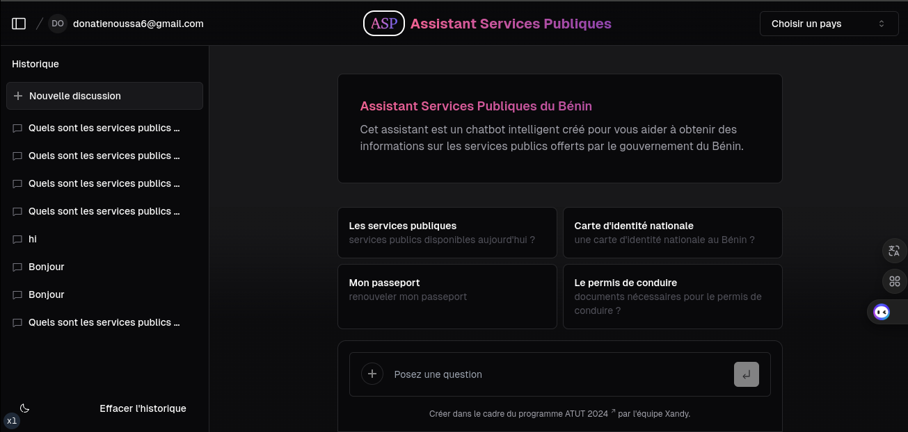

<a href="https://chat.vercel.ai/">

<h1 align="center">Assistant de Service Public - Bénin</h1>
</a>

Un assistant de service public utilisant l'IA, développé avec Next.js, et entraîné sur les données des services publics du Bénin, dans le cadre de la deuxième édition de l'Africa Tech Up Tour.

<a href="#fonctionnalités"><strong>Fonctionnalités</strong></a> ·
<a href="#modèles-dapprentissage"><strong>Modèles d'apprentissage</strong></a> ·
<a href="#déploiement"><strong>Déploiement</strong></a> ·
<a href="#exécution-locale"><strong>Exécution locale</strong></a> ·
<a href="#auteurs"><strong>Auteurs</strong></a>

 

## Fonctionnalités

- [Next.js](https://nextjs.org) pour le routage et le rendu côté serveur
- Composants du serveur React (RSC), Suspense, et actions du serveur pour une gestion optimale des requêtes
- Prise en charge des modèles IA personnalisés, entraînés sur les données des services publics du Bénin
- [Tailwind CSS](https://tailwindcss.com) pour le style et la mise en page
- Icônes fournies par [Phosphor Icons](https://phosphoricons.com)
- Historique des conversations et stockage des sessions avec une base de données personnalisée
- Authentification avec [NextAuth.js](https://github.com/nextauthjs/next-auth)

## Modèles d'apprentissage

Le projet utilise un modèle IA personnalisé, entraîné sur un ensemble de données provenant des services publics du Bénin. Ce modèle a été conçu pour répondre aux questions spécifiques sur les services publics, fournir des informations à jour, et améliorer l'accès aux services gouvernementaux.

Vous pouvez également intégrer d'autres fournisseurs de modèles ou ajuster le modèle actuel pour répondre à des besoins spécifiques.

<!-- ## Déploiement

Déployez votre propre version de l'assistant de service public sur Vercel en un seul clic :

 -->

## Exécution locale

Pour exécuter l'assistant de service public localement, vous devrez utiliser les variables d'environnement définies dans .env.example. Il est recommandé d'utiliser [Vercel Environment Variables](https://vercel.com/docs/projects/environment-variables) pour gérer ces variables, mais un fichier .env est suffisant pour le développement local.

> *Remarque* : Ne commitez pas votre fichier .env, car il contient des informations sensibles.

1. Installez Vercel CLI : npm i -g vercel
2. Liez l'instance locale à votre projet Vercel : vercel link
3. Téléchargez vos variables d'environnement : vercel env pull

bash
npm install
npm run dev

Votre application devrait maintenant être accessible à l'adresse [localhost:3000](http://localhost:3000/).

## Auteurs

Ce projet a été développé par une équipe de data scientists issus du Bénin, du Burkina Faso, et du Togo, dans le cadre de la deuxième édition de l'Africa Tech Up Tour. Notre objectif est de faciliter l'accès aux services publics au Bénin grâce à l'intelligence artificielle.

* *Membres de l'équipe* :
  * **[Ghilth GBAGUIDI]( https://www.linkedin.com/in/ghilth)** - Contributeur, Bénin
  * **[OUEDRAOGO WENDTOIN ISSAKA]( https://www.linkedin.com/in/wendtoinissaka)** - Contributeur, Burkina Faso
  * **[Roland AMOUSSOU](https://www.linkedin.com/in/roland-amoussou-88aab613a)** - Contributeur, Bénin
  * **[Azonvidé Hubert DOSSA](https://www.linkedin.com/in/azonvid%C3%A9-hubert-dossa-aa57bb1a1)** - Contributeur, Bénin
  * **[LOKONON Jérémie](https://www.linkedin.com/in/jérémie-lokonon-176820225)** - Contributeur, Bénin
  * **[BORNA Yannis](https://www.linkedin.com/in/yannis-borna-181049269)** - Contributeur, Bénin
  * **[Léonel VODOUNOU](https://www.linkedin.com/in/léonel-junior-vodounou-7864b0210)** - Contributeur, Bénin
  * **[AKANHO Naofal](https://www.linkedin.com/in/naofal-akanho-642179213/)** - Contributeur, Bénin
  * **[OUSSA Donatien](https://www.linkedin.com/in/donatien-oussa-80269b268/)** - Contributeur, Bénin
  * **[GANDONOU Pamela](https://www.linkedin.com/in/pamela-gandonou-b6986a265)** - Contributeur, Bénin
  * **[HOUNTON Johannes](https://www.linkedin.com/in/johannes-hounton-a87954271)** - Contributeur, Bénin
  * **[MINABA Carine](https://www.linkedin.com/in/carine-minaba-116433280/)** - Contributeur, Bénin
  * **[ABOUDOU ALI Faoziath](https://www.linkedin.com/in/faoziath-aboudou-ali)** - Contributeur, Bénin